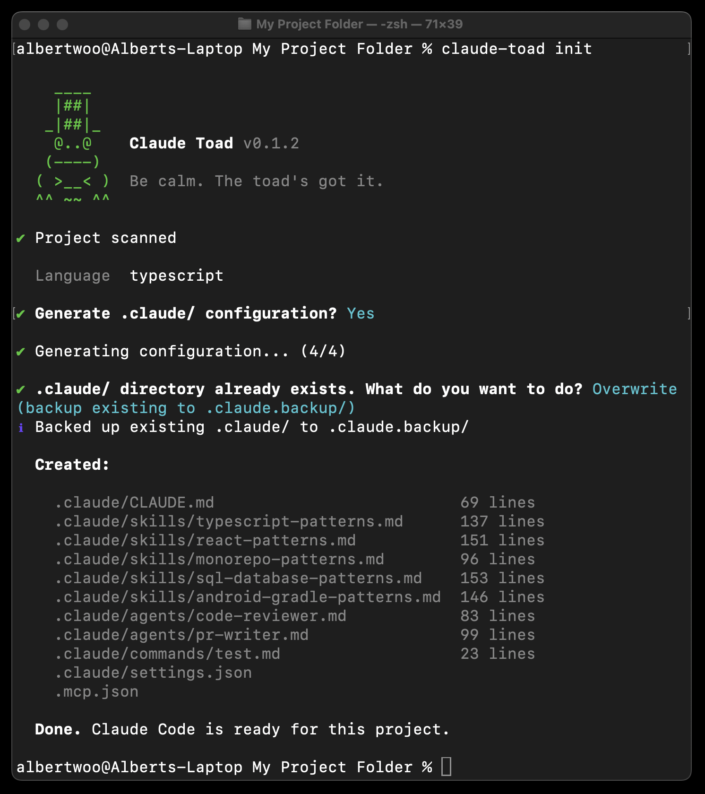

# Claude Toad

Scans your project. Generates your entire `.claude/` directory. One command.

```
npx claude-toad init
```

---

## Why this exists

I kept starting new Claude Code sessions and watching the agent ask the same questions every single time. What framework is this? Where are the tests? How do I run the dev server? I watched a YouTube video and tried writing a CLAUDE.md myself. Ended up rewriting it several times. Then I read a blog post that said everything I put in it was wrong. Hit 300 lines before learning Anthropic recommends under 150. Learned that "as instruction count increases, instruction-following quality decreases uniformly."

After that I discovered skills, agents, commands, hooks, settings.json scope hierarchies, and .mcp.json. Eight configuration surfaces, each with their own format. I realized the CLAUDE.md was just the beginning of the problem.

So, I decided to build a thing that does it for me.

Claude Toad reads your repo, figures out what you're working with, calls Claude API (your key, your tokens), and generates the whole `.claude/` directory. You get a configuration built from what's actually in your project.

---

## What it looks like



Then you open Claude Code and it just... knows.

---

## How it works

**Step 1: Scan.** Reads your package.json, tsconfig, prisma schema, test configs, CI setup, README, directory structure. No AI. Pure file system reads. Fast.

**Step 2: Generate.** Sends the project fingerprint to Claude's API. Your key, your tokens. Four focused API calls on Opus. Each call has one job: CLAUDE.md, skills, agents, then commands and hooks. Focused calls produce better output than asking one call to do everything.

**Step 3: Write.** Drops everything into `.claude/`. Every file tagged `# Generated by Claude Toad - Review before use`. You're in control.

---

## Four commands

### `init`

Point it at an existing project. It scans, generates, writes.

```
npx claude-toad init
```

### `new`

Start a fresh project with Claude Code configured from the first commit. Interactive setup: pick your stack, your services, your conventions.

```
npx claude-toad new
```

### `package`

Bundle your `.claude/` directory into an installable plugin. One person configures, everyone on the team installs.

```
npx claude-toad package
npx claude-toad install my-team-config.zip
```

### `add-skill`

Turn your own material into skills. Accepts YouTube videos, PDFs, docs, URLs, audio files. Integrates with [Smidge](https://smdg.app) for generation.

```
npx claude-toad add-skill --from "https://youtube.com/watch?v=..."
npx claude-toad add-skill --from "./docs/api-guide.pdf"
```

Requires a Smidge API key (prompted on first use).

---

## What you get

| File | What it does |
|------|-------------|
| `CLAUDE.md` | Your project in under 150 lines. Stack, architecture, commands, conventions, gotchas. |
| `skills/*.md` | Deep knowledge for your specific framework, database, and testing setup. Loaded only when relevant. |
| `agents/*.md` | Code reviewer and PR writer that know your language and standards. |
| `commands/*.md` | Slash commands for test, deploy, and whatever else your project needs. |
| `settings.json` | Permissions and hooks. Sensible defaults. No `dangerously-skip-permissions`. |
| `.mcp.json` | MCP servers for the services you actually use. Nothing you don't. |

---

## Supported stacks

Next.js (App Router + Pages), React, Remix, SvelteKit, Astro, Nuxt, Express, Fastify, NestJS, Hono, FastAPI, Django, Flask, Go, Rails, Rust.

More coming. [Adding a framework takes one PR.](CONTRIBUTING.md)

---

## Flags

```
--dry-run       See what would be generated without writing anything.
--model sonnet  Use Sonnet instead of the default (Opus).
--force         Skip confirmation prompts.
--verbose       Show the full project scan.
--no-agents     Skip agent generation.
--no-mcp        Skip MCP configuration.
--api-key KEY   Pass key directly (for CI/scripts).
```

---

## Setup

```
npx claude-toad init
```

First run asks for your Anthropic API key. Stored locally at `~/.claude-toad/config.json`. Never sent anywhere except directly to Anthropic's API. If you already have `ANTHROPIC_API_KEY` set, Claude Toad picks it up automatically.

---

## Custom skills

The `add-skill` command integrates with [Smidge](https://smdg.app) to generate skills from source material. YouTube videos, PDFs, documentation, audio, raw text. Smidge handles the extraction and formatting so the output works across Claude Code and other AI coding tools.

You'll need a Smidge account and API key. Generate one from your [account page](https://smdg.app/account). The CLI prompts you the first time.

---

## Team config

```
# One person configures
npx claude-toad init
# Tweak it. Then:
npx claude-toad package

# Everyone else
npx claude-toad install team-config.zip
```

---

## Open source

MIT License. BYOK. Runs locally. No telemetry. No analytics. No phoning home.

Your API key goes to Anthropic and nowhere else. Your code never leaves your machine.

---

## Contributing

I'd like framework detectors. If Claude Toad doesn't recognize your stack, [add it](CONTRIBUTING.md). One file, one PR.

Also welcome: prompt improvements, bug fixes, documentation.

---

## Requirements

- Node.js 18+
- Anthropic API key ([console.anthropic.com](https://console.anthropic.com))
- Smidge API key for `add-skill` only ([smdg.app/account](https://smdg.app/account))

---

<p align="center">
<i>Relax. The Toad's got it.</i>
</p>
